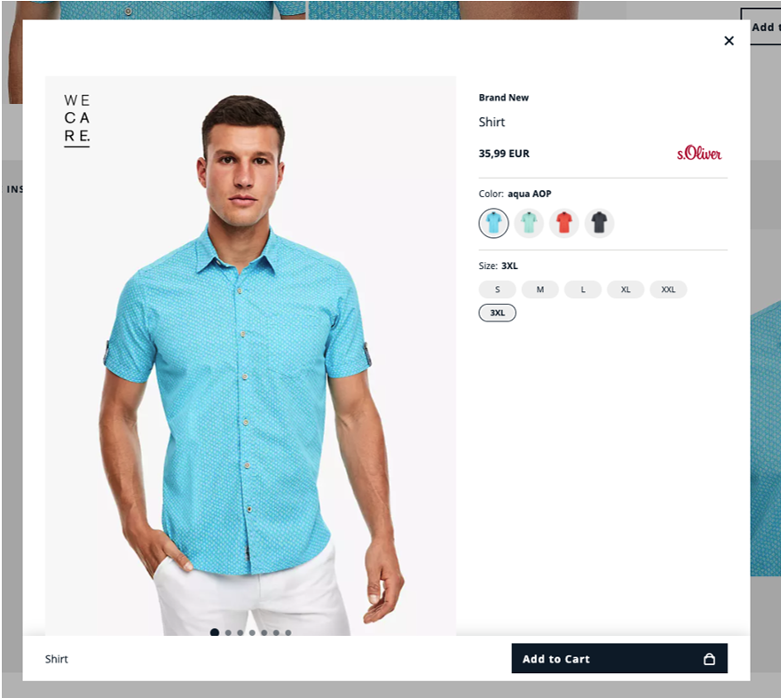
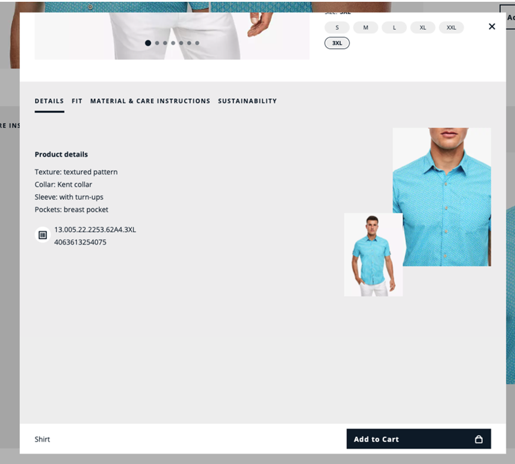
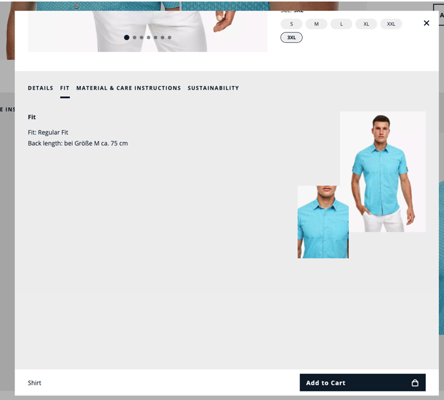
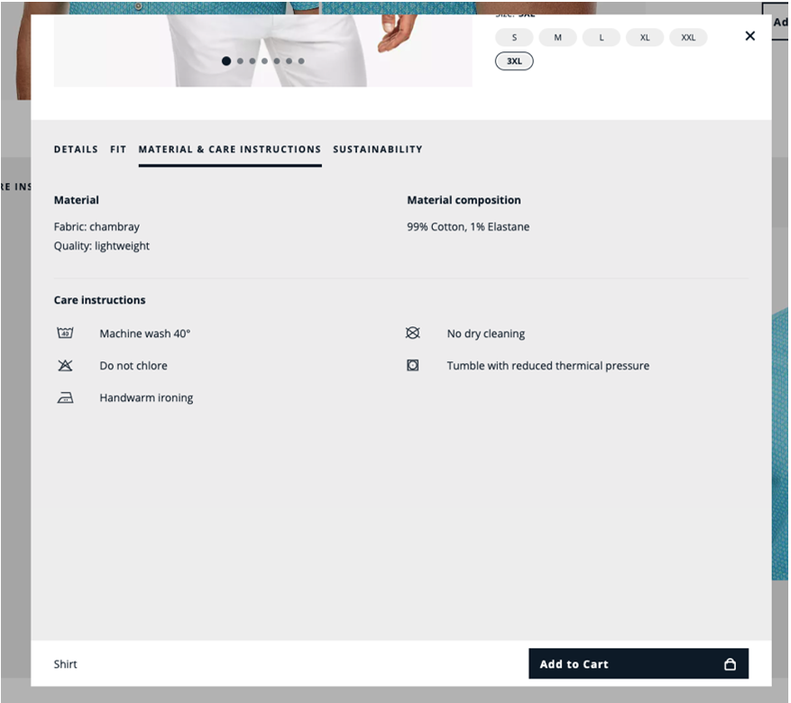
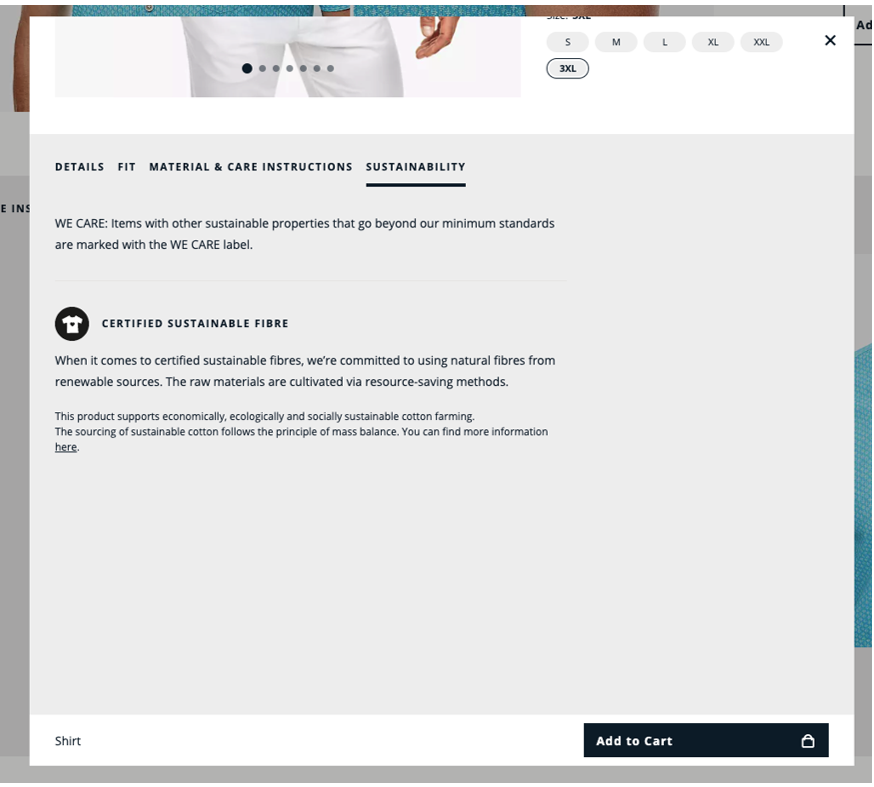

# Coding Challenge

As a QA Engineer, it is your responsibility to create a test plan for the recent development (see original dev-story below). This includes the careful examination of the result, ensuring quality measures, and adequate documentation of the process. The test plan should clearly define which test cases need to be conducted to verify the functionality and design of the frontend. After conducting the tests, it is crucial to analyze the results and ensure that all requirements are met. Finally, detailed documentation must be created that includes not only the test results but also the quality measures taken and any deviations or issues encountered.

For the already delivered result, a test automation should be created to ensure that the required acceptance criteria are also met in the future.

It is important that the requestors are satisfied. So please don't hesitate to contact them if you have any questions, if there is anything unclear or if you want feedback.

## Requestors

Markus Kessler (markus.kessler@de.soliver.com) 

## Original Dev-Story

As s.Oliver E-Shop Product Owner I'd like to present article details in an overlay to our customers. Our customers should be encouraged to buy through the attractive article presentation. At the same time, we expect the number of returned goods to decrease, as our customers see more details before they hit the buy button.

## Acceptance Criteria
There should be a thumbnail on the page which on click opens an overlay with the articles details. (more information below)

The whole website must look nice on all screen sizes. (responsive layout) 

The page must contain at least the following information:
* Pictures of the article
* Name of the article
* Available colors of the article
* Available sizes of the article
* Retail prices of the article

Additionally there should be a tab section with even more details about the article:
* Product details
* Product fit
* Material and care instructions
* Information on sustainability

The footer in the overlay should be sticky. (Article name and call to action) 
Click on a different color changes the slideshow images as well as the availabilities of the sizes

## Design
* An external agency has designed a layout for big screens. You will find these layouts at the end of this document. Please use these drafts for your final design. There are no layouts for smaller screens given. Be creative by yourself.

